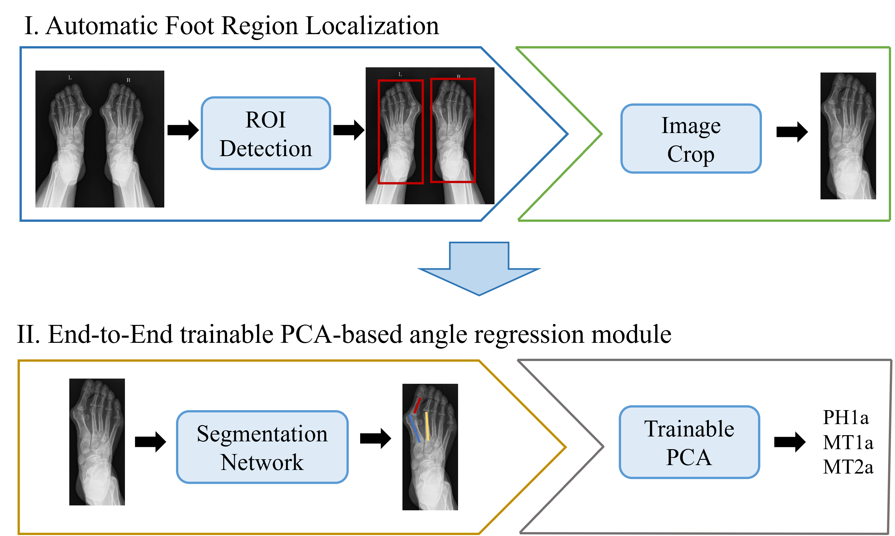

# End-to-End Deep Learning for Angular Estimation in Hallux Valgus from Full-Field Weight-Bearing Radiographs

* As depicted in Figure, the proposed framework comprises two main components: 
(1) a lightweight region-of-interest (ROI) detection module and 
(2) an end-to-end trainable principal component analysis (PCA)-based angle regression module. 
Notably, the framework can process bilateral foot images simultaneously without manual cropping or human intervention.

## 1. lightweight region-of-interest (ROI) detection module
The model is stored in [google drive](https://drive.google.com/file/d/1I4vuSWtSKkh2XfPsxkb2S4SDpRtfKl7V/view?usp=sharing), and inference can be invoked using the Ultralytics framework.
## 2. end-to-end trainable principal component analysis (PCA)-based angle regression module
The models and codes will be updated once our paper is published.....